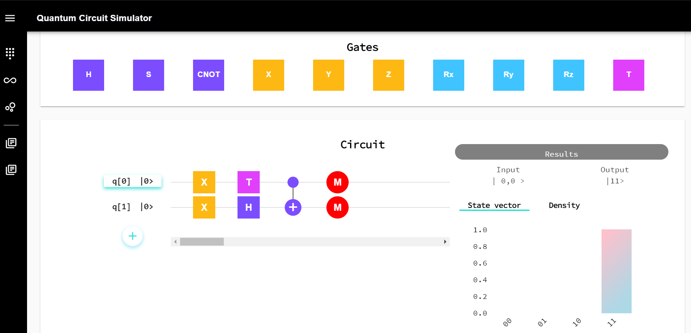

# Quantum Circuit Simulator

A web application that allows the user to graphically build quantum circuits and view the results on a dashboard. This project combines **React(JavaScript)** frontend with a **Flask(Python)** backend that is the host program to call **Q#** functions to perform quantum operations.

I rewrote the backend logic in JavaScript and you can visit the deployed, fully functional app at https://master.d2fi7ys7p5ku9u.amplifyapp.com/.

Backend source code can be found [here](https://github.com/XandraV/quantum-python-backend/).

## Installation

Clone the master branch and then run the following scripts in the project directory:

- `npm install` - to install relevant dependencies

- `npm start` - start the react app

## Resources

| Description                                                        | Link                                                                      |
| :----------------------------------------------------------------- | :------------------------------------------------------------------------ |
| Material-UI components - a popular React UI framework              | [Material-UI docs](https://material-ui.com/getting-started/installation/) |
| Library that utilises tagged template literals to style components | [styled components](https://styled-components.com/)                       |
| React - JavaScript library for building user interfaces            | [create-react-app](https://github.com/facebook/create-react-app)          |